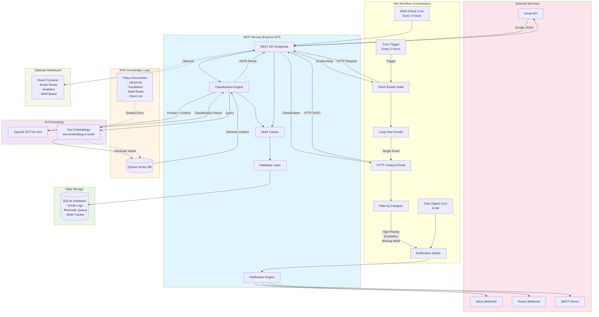
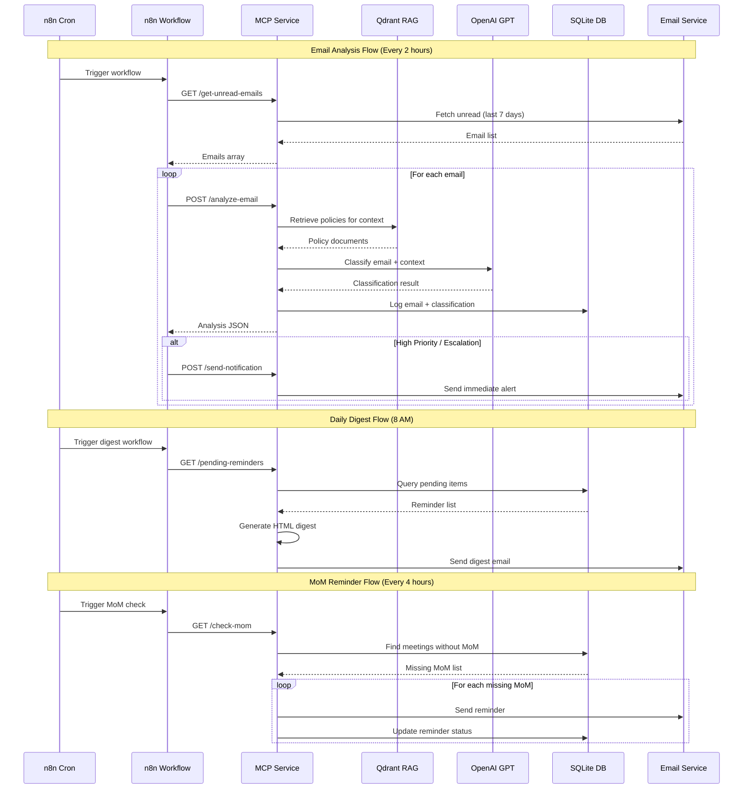
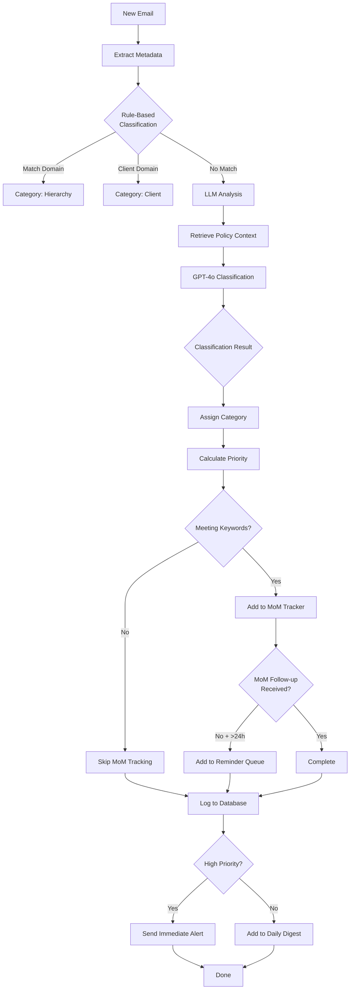

# AI Email Analyzer - System Architecture

This document provides a visual overview of the complete system architecture and data flow.

## High-Level Architecture

## Data Flow Sequence

## Component Responsibilities

### n8n Workflow Orchestration
- **Responsibility**: Trigger scheduled jobs, orchestrate data flow between services
- **Workflows**:
  1. Email Analysis (every 2 hours)
  2. Daily Digest (8 AM daily)
  3. MoM Reminders (every 4 hours)

### MCP Service (Backend API)
- **Responsibility**: Core business logic, email classification, MoM tracking
- **Key Endpoints**:
  - `POST /analyze-email` - Classify single email
  - `GET /get-unread-emails` - Fetch Gmail inbox
  - `POST /check-mom` - Check MoM status
  - `GET /pending-reminders` - Get reminder queue
  - `POST /send-digest` - Trigger digest
  - `POST /embed-policies` - Seed policy docs

### RAG Knowledge Layer (Qdrant)
- **Responsibility**: Store and retrieve classification policies
- **Collections**:
  - `email-policies` - Vector embeddings of policy documents
- **Policy Types**:
  - Hierarchy/Client rules
  - Escalation keywords
  - MoM requirements
  - Urgent task indicators

### AI Processing (OpenAI)
- **Responsibility**: Text understanding and classification
- **Models**:
  - `text-embedding-3-small` - Policy document embeddings
  - `gpt-4o-mini` - Email classification and reasoning

### Database (SQLite)
- **Responsibility**: Persistent storage for logs and tracking
- **Tables**:
  - `email_logs` - All analyzed emails with classifications
  - `reminder_queue` - Pending notifications
  - `mom_tracker` - Meeting and MoM tracking

### Notification Engine
- **Responsibility**: Send alerts via multiple channels
- **Channels**:
  - Email (SMTP) - Digest and immediate alerts
  - Slack - Real-time notifications
  - Teams - Real-time notifications

## Classification Logic

## Technology Stack Summary

| Layer | Technology | Purpose |
|-------|-----------|---------|
| **Orchestration** | n8n | Workflow automation, cron scheduling |
| **Backend** | Node.js + Express | MCP service API |
| **Email API** | Gmail API (OAuth 2.0) | Email fetching |
| **Vector DB** | Qdrant | RAG knowledge storage |
| **LLM** | OpenAI GPT-4o-mini | Classification reasoning |
| **Embeddings** | text-embedding-3-small | Policy document vectors |
| **Database** | SQLite | Email logs, reminders, MoM tracking |
| **Notifications** | nodemailer, Slack/Teams APIs | Multi-channel alerts |
| **Frontend** | React (Optional) | Dashboard UI |
| **Deployment** | Docker Compose | Qdrant + n8n containerization |

## Security Considerations

1. **API Authentication**: MCP service uses JWT tokens for n8n communication
2. **Gmail OAuth**: Secure OAuth 2.0 flow for email access
3. **Environment Variables**: Sensitive credentials stored in `.env` (gitignored)
4. **SMTP Credentials**: Use Gmail App Password or dedicated SMTP service
5. **Webhook Security**: Validate Slack/Teams webhook signatures (optional)

## Scalability Notes

- **Current Design**: Suitable for personal/small team use (~100-500 emails/day)
- **Database**: SQLite is lightweight; consider PostgreSQL for larger scale
- **Qdrant**: Can handle millions of vectors; current setup is self-hosted
- **OpenAI API**: Rate limits apply; consider caching common classifications
- **n8n**: Can scale horizontally for high-volume workflows
